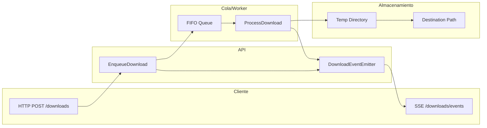

# Documentación Backend de Descarga de Música

## Overview

Sistema de descarga de música con arquitectura **Domain-Driven Design (DDD)** que utiliza **yt-dlp** para obtener contenido de Bandcamp y YouTube Music. Implementa un sistema de cola FIFO con procesamiento en background, caché TTL, eventos SSE en tiempo real, y gestión automática de archivos huérfanos y descargas estancadas.

**Runtime:** Bun • **Framework:** Hono OpenAPI • **Database:** SQLite WAL • **Tool:** yt-dlp

## Quick Start



## Tabla de Contenidos

| Documento                              | Descripción                                                              |
| -------------------------------------- | ------------------------------------------------------------------------ |
| [architecture.md](architecture.md)     | Capas DDD, dependencias y responsabilidades de cada layer                |
| [domain-model.md](domain-model.md)     | Entidades DownloadItem y MediaItem, relaciones ER, máquina de estados    |
| [workflows.md](workflows.md)           | 6 flujos principales con diagramas de secuencia y snippets TypeScript    |
| [infrastructure.md](infrastructure.md) | Patrón Decorator para caché, esquema SQL, Worker con schedulers          |
| [services.md](services.md)             | 5 servicios de aplicación con diagramas de actividad y lógica core       |
| [sse-system.md](sse-system.md)         | Sistema SSE con buffer circular, throttling, y mecanismo de recuperación |

## Architecture Highlights

- **🏗️ DDD 4 Layers:** Domain entities → Application use cases → Infrastructure repos → API routes. [Ver capas](architecture.md#capas-y-responsabilidades)
- **📋 FIFO Queue:** Worker procesa descargas en orden con consulta `ORDER BY started_at ASC`. [Ver Worker](infrastructure.md#worker)
- **⚡ Cache TTL Strategy:** Decorator pattern con 30s para downloads, 5min para media. [Ver Decorator](infrastructure.md#cached-repositories-decorator-pattern)
- **🔄 SSE Buffer Recovery:** Buffer circular 100 eventos + lastEventId para detectar gaps. [Ver SSE](sse-system.md#mecanismo-de-recuperación)
- **⏰ Automated Schedulers:** Cleanup archivos huérfanos cada 7 días + stalled check cada 5 minutos. [Ver schedulers](workflows.md#markStalledDownloads-y-CleanupOrphanedFiles)
- **🚫 Duplicate Prevention:** Normalización de URL + check `normalized_url + status IN (pending, in_progress)`. [Ver normalización](services.md#urlnormalizer)

## Glosario

- **_URL normalizada_:** URL con protocol y domain en lowercase preservando path/query para detectar duplicados.
- **_Descarga estancada_:** Download con status `in_progress` sin actualización de progress durante +10 minutos.
- **_Archivo huérfano_:** File en filesystem sin registro correspondiente en tabla `downloads`.
- **_Throttling_:** Limitación de eventos SSE progress a máximo 1 cada 500ms por downloadId.
- **_Buffer circular_:** Estructura de 100 elementos con push/shift para mantener últimos eventos SSE.

## Tech Stack

```
Bun v1.x            Runtime JavaScript/TypeScript
Hono OpenAPI        Framework API REST con validación Zod
SQLite WAL          Base de datos con modo Write-Ahead Logging
yt-dlp              Herramienta descarga Bandcamp/YouTube Music
Zod                 Validación de schemas TypeScript-first
Mermaid             Generación de diagramas en markdown
```

## Recomendaciones

⚠️ **Performance:** Considerar implementar rate limiting por IP para endpoints POST (actualmente solo hay límite de 10 descargas pending)

💡 **Escalabilidad:** Para cargas >100 descargas simultáneas evaluar migrar a queue distribuida (BullMQ + Redis)

✅ **Monitoring:** Implementar métricas Prometheus para tracking de:

- Tiempo promedio de descarga por provider
- Ratio success/failed downloads
- Tamaño buffer SSE (detectar memory leaks)
- Espacio disponible en disco

🔧 **Testing:** Documentación incluye lógica core extraíble para unit tests aislados del framework
