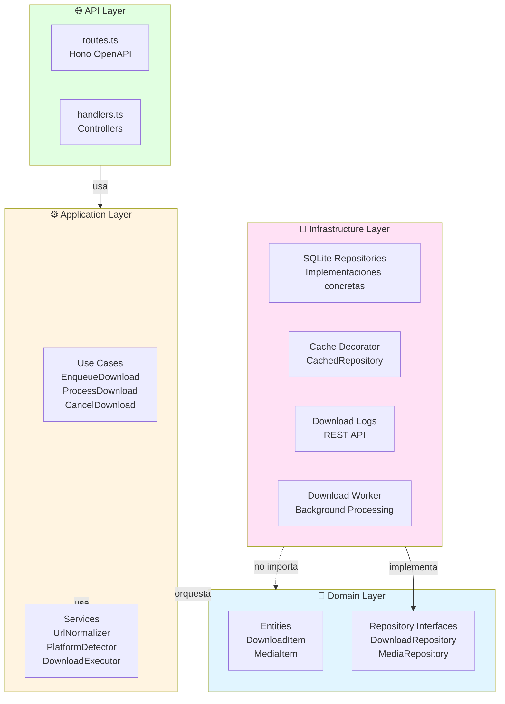

# Arquitectura del Sistema

Este documento describe la arquitectura general del sistema de descargas de música, siguiendo los principios de **Domain-Driven Design (DDD)** con separación estricta de responsabilidades en capas.

## Diagrama de Capas DDD



## Responsabilidades por Capa

### 🌐 API Layer (Capa de Presentación)

**Propósito**: Exponer endpoints HTTP con validación de schemas y documentación OpenAPI.

| Archivo                                           | Responsabilidad                             |
| ------------------------------------------------- | ------------------------------------------- |
| [routes.ts](../src/router/download/routes.ts)     | Definición de rutas OpenAPI con schemas Zod |
| [handlers.ts](../src/router/download/handlers.ts) | Controllers que invocan use cases           |
| [sse.ts](../src/router/download/sse.ts)           | Handler SSE para eventos tiempo real        |

**Características**:

- Validación de entrada con Zod
- Transformación de errores a códigos HTTP
- Sin lógica de negocio
- Documentación automática con Scalar

### ⚙️ Application Layer (Capa de Aplicación)

**Propósito**: Orquestar la lógica de negocio coordinando entidades de dominio y servicios.

| Archivo                                                                                | Responsabilidad                         |
| -------------------------------------------------------------------------------------- | --------------------------------------- |
| [EnqueueDownload.ts](../src/core/application/download/use-cases/EnqueueDownload.ts)    | Encolar nueva descarga con validaciones |
| [ProcessDownload.ts](../src/core/application/download/use-cases/ProcessDownload.ts)    | Ejecutar descarga con yt-dlp            |
| [CancelDownload.ts](../src/core/application/download/use-cases/CancelDownload.ts)      | Cancelar descarga activa                |
| [DownloadExecutor.ts](../src/core/application/download/services/DownloadExecutor.ts)   | Spawning y gestión de procesos yt-dlp   |
| [MetadataExtractor.ts](../src/core/application/download/services/MetadataExtractor.ts) | Extracción metadata con yt-dlp          |
| [PlatformDetector.ts](../src/core/application/download/services/PlatformDetector.ts)   | Detección y validación de plataforma    |

**Características**:

- Orquestación de workflows
- Coordinación entre repositorios
- Emisión de eventos SSE
- Sin dependencias de infraestructura concreta

### 💎 Domain Layer (Capa de Dominio)

**Propósito**: Definir modelos de negocio puros sin dependencias externas.

| Archivo                                                                                   | Responsabilidad                            |
| ----------------------------------------------------------------------------------------- | ------------------------------------------ |
| [download.ts](../src/core/domain/download/entities/download.ts)                           | Entidad `DownloadItem` con factory methods |
| [media.ts](../src/core/domain/media/entities/media.ts)                                    | Entidad `MediaItem` con factory methods    |
| [download-repository.ts](../src/core/domain/download/repositories/download-repository.ts) | Interface repositorio downloads            |
| [media-repository.ts](../src/core/domain/media/repositories/media-repository.ts)          | Interface repositorio media                |

**Características**:

- Entidades inmutables (readonly properties)
- Factory methods para construcción
- Sin imports de otras capas
- Interfaces puras (contratos)

### 🔧 Infrastructure Layer (Capa de Infraestructura)

**Propósito**: Implementar detalles técnicos y acceso a recursos externos.

| Archivo                                                                                               | Responsabilidad                      |
| ----------------------------------------------------------------------------------------------------- | ------------------------------------ |
| [SQLiteDownloadRepository.ts](../src/core/infrastructure/downloads/SQLiteDownloadRepository.ts)       | Implementación SQLite para downloads |
| [SQLiteMediaRepository.ts](../src/core/infrastructure/downloads/SQLiteMediaRepository.ts)             | Implementación SQLite para media     |
| [CachedDownloadRepository.ts](../src/core/infrastructure/cache/CachedDownloadRepository.ts)           | Decorator con cache TTL              |
| [SQLiteDownloadLogRepository.ts](../src/core/infrastructure/downloads/SQLiteDownloadLogRepository.ts) | Repositorio de logs en SQLite        |
| [CachedDownloadLogRepository.ts](../src/core/infrastructure/cache/CachedDownloadLogRepository.ts)     | Cache decorator para logs            |
| [DownloadWorker.ts](../src/core/application/download/worker/DownloadWorker.ts)                        | Worker background FIFO               |

**Características**:

- Implementaciones concretas de interfaces
- Acceso a base de datos, filesystem, procesos
- Cache y optimizaciones
- No contiene lógica de negocio

## Ejemplo: Factory Method con Manejo de Nulls

```typescript
// src/core/domain/download/entities/download.ts
static fromDatabase(row: DatabaseRow): DownloadItem {
  return new DownloadItem(
    row.id,
    row.url,
    row.normalized_url,
    row.media_id,                              // puede ser null
    row.status as DownloadStatus,
    row.progress ?? 0,                         // default 0 si null
    row.error_message,                         // puede ser null
    row.file_path,                             // puede ser null
    row.process_id,                            // puede ser null
    new Date(row.created_at),
    row.started_at ? new Date(row.started_at) : null,
    row.finished_at ? new Date(row.finished_at) : null
  );
}
```

Este factory method demuestra el manejo de campos nullables típico en la capa de dominio. Los campos como `media_id`, `file_path` y timestamps pueden ser `null` dependiendo del estado del download.

## Recomendaciones

⚠️ **Nunca importar capa Infraestructura en Dominio**: Las entidades e interfaces de dominio deben ser completamente independientes de detalles de implementación. Esto permite cambiar bases de datos, caches o cualquier tecnología sin tocar el dominio.

✅ **Inyectar dependencias via constructor**: Los use cases reciben todas sus dependencias (repositorios, servicios, logger) en el constructor, facilitando testing con mocks y siguiendo Dependency Inversion Principle.

💡 **Usar interfaces de repositorio en lugar de implementaciones**: Los use cases dependen de `DownloadRepository` (interface), no de `SQLiteDownloadRepository` (implementación). Esto permite swap de implementaciones sin cambios en lógica de negocio.

🔧 **Mantener entidades inmutables con factory methods**: Las entidades usan `readonly` properties y proveen factory methods estáticos (`fromDatabase`, `fromYtDlpMetadata`, `toJSON`) para construcción y serialización, evitando mutaciones accidentales.

---

**Ver también**:

- [Modelo de Dominio](domain-model.md) - Detalles de entidades y relaciones
- [Workflows](workflows.md) - Flujos de operaciones principales
- [Infraestructura](infrastructure.md) - Detalles de implementaciones
