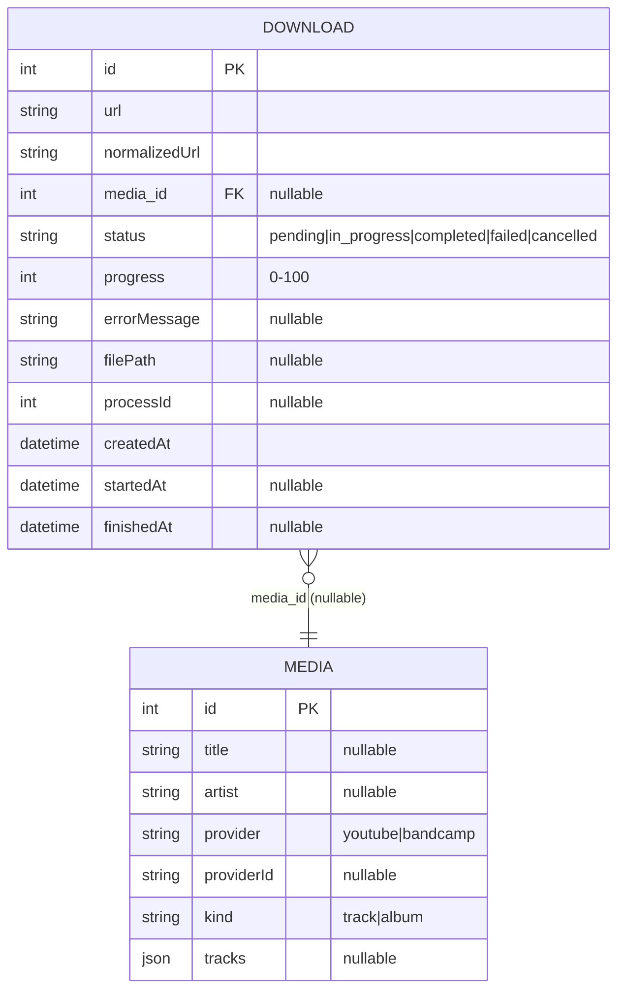
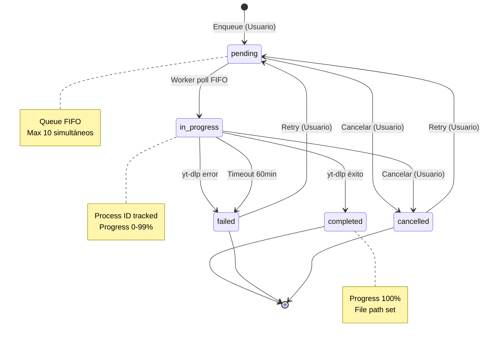

# Modelo de Dominio

Este documento describe las entidades del dominio, sus relaciones y el ciclo de vida de las descargas.

## Diagrama de Relaciones



**Constraint clave**: `UNIQUE(provider, provider_id)` en tabla `media` previene duplicados por proveedor.

**Foreign Key**: `media_id` con `ON DELETE SET NULL` - si se elimina media, downloads quedan con `media_id = null`.

## Máquina de Estados: Download



### Transiciones

| Estado        | Siguiente Estado | Trigger                                        | Actor            |
| ------------- | ---------------- | ---------------------------------------------- | ---------------- |
| `pending`     | `in_progress`    | Worker poll con `findNextPending()`            | Worker           |
| `pending`     | `cancelled`      | Usuario invoca `CancelDownload`                | Usuario          |
| `in_progress` | `completed`      | Proceso yt-dlp exit code 0                     | DownloadExecutor |
| `in_progress` | `failed`         | Proceso yt-dlp exit code != 0                  | DownloadExecutor |
| `in_progress` | `failed`         | Scheduler detecta timeout >60min               | Scheduler        |
| `in_progress` | `cancelled`      | Usuario invoca `CancelDownload` + kill process | Usuario          |
| `failed`      | `pending`        | Usuario invoca `RetryDownload`                 | Usuario          |
| `cancelled`   | `pending`        | Usuario invoca `RetryDownload`                 | Usuario          |

## Entidad: MediaItem

### Factory Method con Metadata Nullable

```typescript
// src/core/domain/media/entities/media.ts
static async fromYtDlpMetadata(data: YtDlpOutput, provider: Provider): Promise<MediaItem> {
  const tracks = data.entries
    ? data.entries.map((entry: any, index: number) => ({
        track: entry.playlist_index ?? index + 1,
        title: entry.title ?? null,              // nullable si falta
        duration: entry.duration ?? null          // nullable si falta
      }))
    : null;

  return new MediaItem(
    null,                                          // id asignado por DB
    data.title ?? null,                           // todos nullable
    (data.artist || data.uploader) ?? null,
    data.album ?? null,
    data.album_artist ?? null,
    data.release_year?.toString() ?? null,
    data.thumbnail ?? null,
    data.duration ?? null,
    provider,                                      // requerido
    data.id ?? null,
    data._type === "playlist" ? "album" : "track",
    tracks,
    null,                                          // timestamps asignados por DB
    null
  );
}
```

Este factory demuestra la **tolerancia a metadata incompleta**: todos los campos son nullable excepto `id` (asignado por DB), `provider` (conocido), y timestamps (automáticos). Permite trabajar con fuentes imperfectas y soporta edición manual posterior.

### Ejemplo: Metadata Incompleta de Bandcamp

```typescript
// Metadata real de Bandcamp puede faltar artist
const bandcampData = {
	id: 'xyz789',
	title: 'Album Name',
	// artist: undefined (no proporcionado)
	thumbnail: 'https://f4.bcbits.com/img/...',
	entries: [
		{ title: 'Track 1', duration: 180 },
		{ title: 'Track 2', duration: null } // sin duration
	]
};

const media = MediaItem.fromYtDlpMetadata(bandcampData, 'bandcamp');
// Resultado:
// - artist: null (editable posteriormente)
// - tracks[1].duration: null (información no disponible)
// - kind: 'album' (detectado por entries)
```

## Recomendaciones

✅ **Usar `normalizedUrl` para detección de duplicados activos**: El método `findActiveByNormalizedUrl()` previene duplicados comparando URLs con protocol y domain en lowercase. Esto evita duplicados por variaciones de capitalización (`https://BANDCAMP.com` vs `https://bandcamp.com`).

💡 **Permitir todos los campos Media nullable excepto id/provider/timestamps**: Regla de negocio que permite almacenar media con información incompleta. Los campos nullable son: `title`, `artist`, `album`, `album_artist`, `year`, `cover_url`, `duration`, `provider_id`, `kind`, `tracks`. Esto soporta múltiples fuentes de metadata y edición manual posterior.

⚠️ **Rechazar edición de `provider` y `provider_id` en actualizaciones**: Estos campos son inmutables después de creación porque identifican la fuente original. El método `updateMetadata()` del repositorio debe validar que estos campos no estén en el payload de actualización y lanzar error 400 si se incluyen.

🔧 **Constraint UNIQUE `(provider, provider_id)` previene duplicados en base de datos**: El constraint con `ON CONFLICT IGNORE` asegura que solo existe un registro de media por combinación provider+provider_id. Si `EnqueueDownload` intenta crear media duplicada, SQLite ignora silenciosamente el INSERT y el código busca la existente con `findByProviderAndProviderId()`.

---

**Ver también**:

- [Arquitectura](architecture.md) - Capas DDD y responsabilidades
- [Infrastructure](infrastructure.md#esquema-base-de-datos) - Schema SQL completo con índices
- [Workflows](workflows.md) - Flujos de operaciones que usan estas entidades
