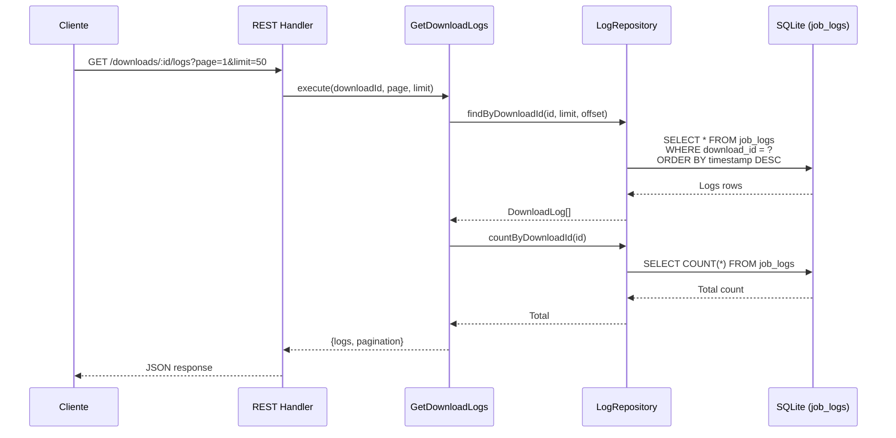
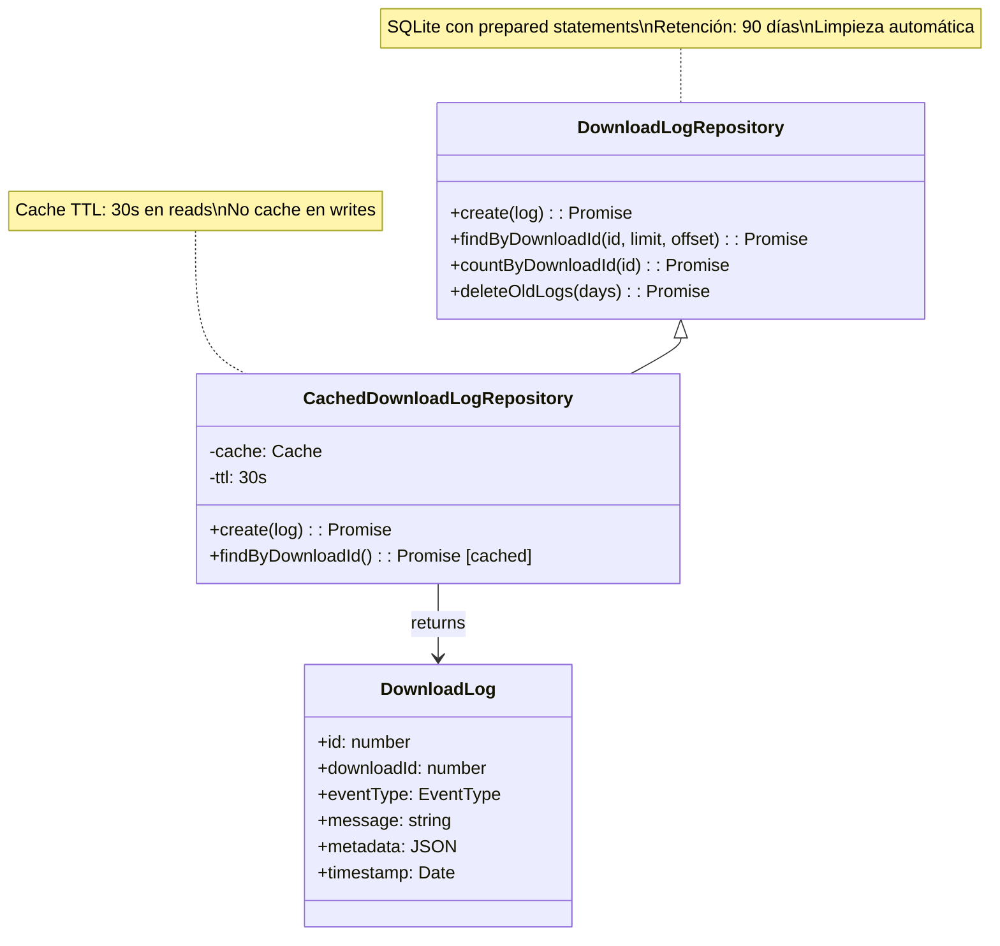

# Sistema de Logs de Descargas (REST API)

Este documento describe el sistema de logs persistentes para descargas usando REST API con paginación.

## Arquitectura de Logs



## Componentes del Sistema



## Tabla de Eventos

| Evento | Trigger | Mensaje Descriptivo | Metadata |
|--------|---------|---------------------|----------|
| `download:enqueued` | Usuario encola descarga | "Download enqueued: {url}" | `{url, provider}` |
| `download:started` | Worker inicia proceso | "Starting download: {url}" | `{url}` |
| `download:progress` | Actualización progreso (≥5% delta) | "Download progress: {progress}%" | `{progress}` |
| `download:completed` | Descarga exitosa | "Download completed successfully" | `{filePath}` |
| `download:failed` | Error en descarga | "Download failed: {error}" | `{error}` |
| `download:cancelled` | Usuario cancela | "Download cancelled by user" | `{url}` |
| `download:stalled` | Timeout detectado | "Download stalled after {minutes} minutes" | `{url, progress, inactiveMinutes}` |
| `storage:low` | Espacio insuficiente | "Insufficient storage: {available}GB" | `{availableGB, requiredGB}` |
| `metadata:fetching` | Extrayendo metadata | "Fetching metadata from {provider}" | `{provider, url}` |
| `metadata:found` | Metadata obtenida | "Found {N} tracks in album \"{title}\"" | `{title, artist, trackCount, isPlaylist}` |

## Throttling de Progreso

El sistema implementa throttling del 5% para eventos de progreso:

- Solo se registra un log cuando el progreso cambia ≥5% o alcanza 100%
- Tracking mediante `Map<downloadId, lastLoggedProgress>` estático en ProcessDownload
- Evita saturar la base de datos con actualizaciones de progreso frecuentes
- Mantiene visibilidad suficiente del progreso para el usuario

## API REST

### GET /api/downloads/:id/logs

Recupera los logs de una descarga con paginación.

**Query Parameters:**
- `page` (opcional): Número de página (1-indexed, default: 1)
- `limit` (opcional): Logs por página (max: 100, default: 50)

**Response 200:**
```json
{
  "logs": [
    {
      "id": 150,
      "downloadId": 42,
      "eventType": "download:completed",
      "message": "Download completed successfully",
      "metadata": {"filePath": "/tmp/downloads/song.opus"},
      "timestamp": "2024-01-15T11:45:30Z"
    },
    {
      "id": 149,
      "downloadId": 42,
      "eventType": "download:progress",
      "message": "Download progress: 95%",
      "metadata": {"progress": 95},
      "timestamp": "2024-01-15T11:45:20Z"
    }
  ],
  "pagination": {
    "page": 1,
    "limit": 50,
    "total": 85,
    "totalPages": 2
  }
}
```

**Response 404:**
```json
{
  "error": "Download 42 not found"
}
```

## Limpieza Automática

El sistema incluye limpieza automática de logs antiguos:

- **Retención**: 90 días por defecto
- **Ejecución**: Scheduler del DownloadWorker (cada 7 días)
- **Método**: `deleteOldLogs()` en repository
- **SQL**: `DELETE FROM job_logs WHERE timestamp < datetime('now', '-90 days')`
- **Logging**: Count de logs eliminados registrado

## Ventajas sobre SSE

1. **Persistencia**: Los logs se mantienen en base de datos, no en buffer volátil
2. **Historial completo**: Acceso a todo el historial de una descarga sin límite de buffer
3. **No requiere conexión persistente**: Polling bajo demanda, sin mantener conexiones WebSocket/SSE
4. **Paginación**: Manejo eficiente de grandes volúmenes de logs
5. **Cache**: Mejora performance con cache de 30s en queries frecuentes
6. **Más simple**: Sin complejidad de reconexión, gaps, o keepalives
7. **RESTful**: Integración natural con arquitectura REST existente

## Schema SQLite

```sql
CREATE TABLE IF NOT EXISTS job_logs (
  id INTEGER PRIMARY KEY AUTOINCREMENT,
  download_id INTEGER NOT NULL,
  event_type TEXT NOT NULL,
  message TEXT NOT NULL,
  metadata TEXT,
  timestamp DATETIME DEFAULT CURRENT_TIMESTAMP,
  FOREIGN KEY (download_id) REFERENCES downloads(id) ON DELETE CASCADE
);

CREATE INDEX IF NOT EXISTS idx_job_logs_download_id ON job_logs(download_id);
CREATE INDEX IF NOT EXISTS idx_job_logs_timestamp ON job_logs(timestamp);
```

## Integración en Use Cases

Cada use case que antes emitía eventos SSE ahora crea logs persistentes:

```typescript
// Antes (SSE)
this.eventEmitter.emitWithId("download:started", {
  downloadId: download.id,
  url: download.url,
  status: "in_progress",
});

// Ahora (Logs)
await this.downloadLogRepo.create({
  downloadId: download.id,
  eventType: "download:started",
  message: `Starting download: ${download.url}`,
  metadata: { url: download.url },
});
```

Los logs proveen mensajes descriptivos orientados al usuario final, mientras que metadata contiene datos estructurados para debugging.
