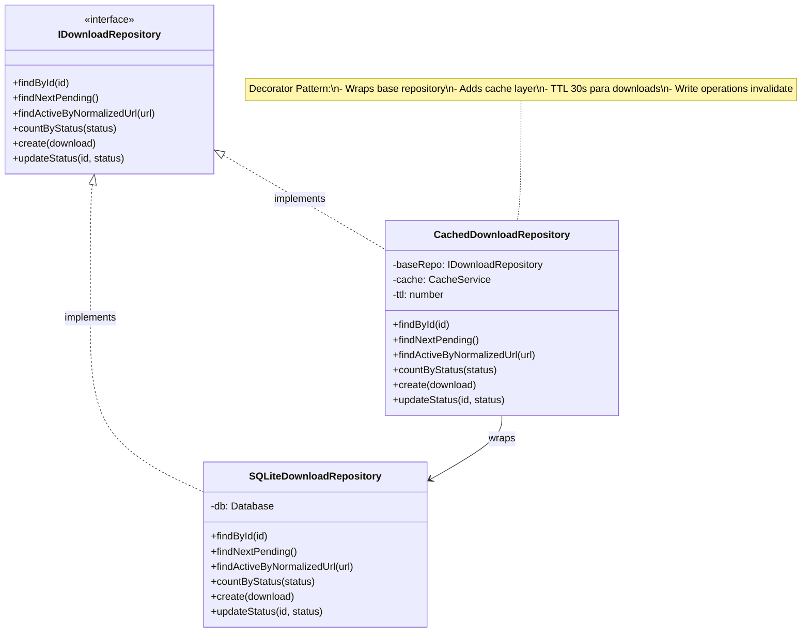
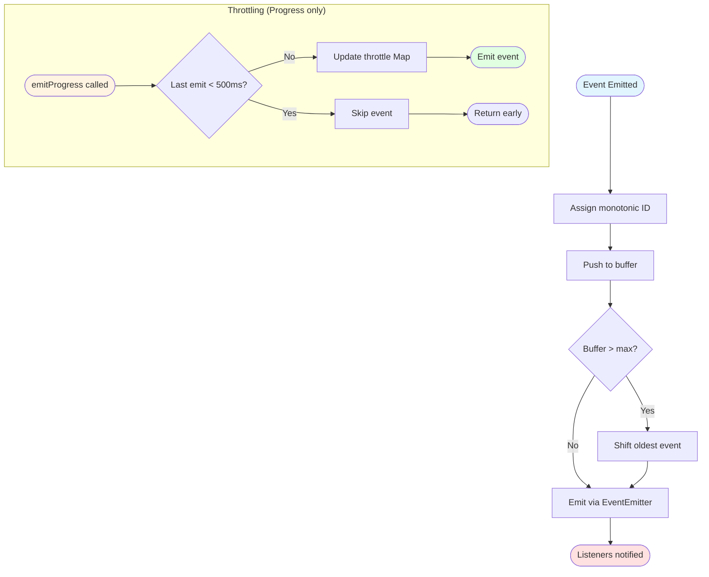
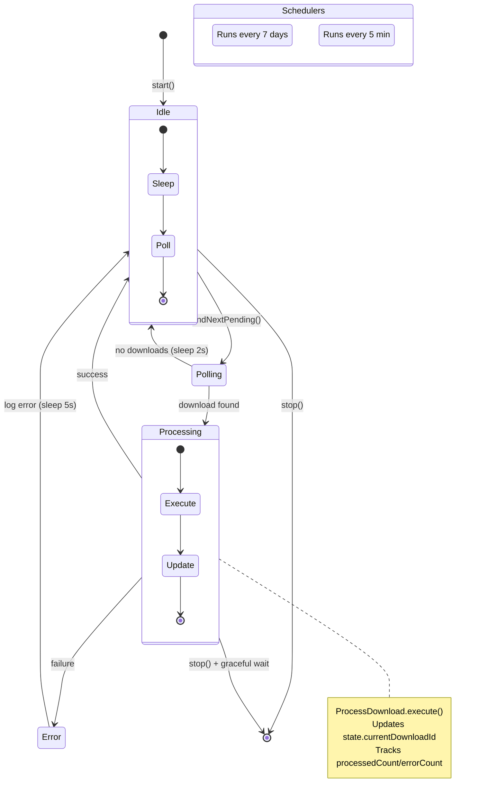

# Infraestructura

Este documento describe los componentes de infraestructura: repositorios, cache, eventos y workers.

## Patrón Decorator para Cache

El sistema usa el **Decorator Pattern** para agregar cache transparente a los repositorios SQLite sin modificar su implementación.



### Snippet: Decorator con Cache TTL

```typescript
// src/core/infrastructure/cache/CachedDownloadRepository.ts
async findById(id: number): Promise<DownloadItem | null> {
  return withCache(
    `downloads:${id}`,                    // cache key
    () => this.baseRepo.findById(id),     // function to cache
    this.ttl                               // 30 seconds
  );
}

// Write operations invalidan cache automáticamente
async updateStatus(id: number, status: DownloadStatus, progress: number): Promise<void> {
  await this.baseRepo.updateStatus(id, status, progress);
  // TTL expiry maneja invalidación (no explicit cache clear)
}
```

**TTL Strategy**:

- **Downloads: 30 segundos** - Alta volatilidad (status cambia frecuentemente)
- **Media: 5 minutos** - Baja volatilidad (metadata estable)

**Operaciones no cacheadas**:

- `findNextPending()` - Debe ser real-time para FIFO correcto
- Write operations (`create`, `update`, `delete`)

## Esquema de Base de Datos

### Tabla: media

```sql
CREATE TABLE IF NOT EXISTS media (
  id INTEGER PRIMARY KEY AUTOINCREMENT,
  title TEXT,
  artist TEXT,
  album TEXT,
  album_artist TEXT,
  year TEXT,
  cover_url TEXT,
  duration INTEGER,
  provider TEXT NOT NULL,           -- 'youtube' | 'bandcamp'
  provider_id TEXT,
  kind TEXT,                        -- 'track' | 'album'
  tracks TEXT,                      -- JSON array
  created_at TEXT NOT NULL DEFAULT (datetime('now')),
  updated_at TEXT NOT NULL DEFAULT (datetime('now')),
  UNIQUE(provider, provider_id) ON CONFLICT IGNORE
);
```

**Constraint clave**: `UNIQUE(provider, provider_id)` previene duplicados. `ON CONFLICT IGNORE` permite INSERT idempotente.

### Tabla: downloads

```sql
CREATE TABLE IF NOT EXISTS downloads (
  id INTEGER PRIMARY KEY AUTOINCREMENT,
  url TEXT NOT NULL,
  normalized_url TEXT NOT NULL,
  media_id INTEGER,
  status TEXT NOT NULL CHECK(
    status IN ('pending', 'in_progress', 'completed', 'failed', 'cancelled')
  ),
  progress INTEGER DEFAULT 0,
  error_message TEXT,
  file_path TEXT,
  process_id INTEGER,
  created_at TEXT NOT NULL DEFAULT (datetime('now')),
  started_at TEXT,
  finished_at TEXT,
  FOREIGN KEY (media_id) REFERENCES media(id) ON DELETE SET NULL
);
```

**Índices compuestos críticos**:

- `idx_downloads_normalized_url_status` - Detección rápida de duplicados activos
- `idx_downloads_status_started_at` - Query eficiente de downloads estancados

**Índices simples**:

- `idx_downloads_status` - Poll de pending downloads
- `idx_downloads_created_at` - Ordenamiento FIFO
- `idx_media_provider_id` - Búsqueda por provider ID

Ver [queries.ts](../src/lib/db/downloads/queries.ts) para CREATE INDEX statements completos.

### Snippet: Query FIFO

```typescript
// Obtener siguiente download pending (FIFO)
async findNextPending(): Promise<DownloadItem | null> {
  const query = `
    SELECT * FROM downloads
    WHERE status = 'pending'
    ORDER BY created_at ASC
    LIMIT 1
  `;
  const row = this.db.query(query).get();
  return row ? DownloadItem.fromDatabase(row) : null;
}
```

### Snippet: Detección de Duplicados

```typescript
// Buscar downloads activos con URL normalizada
async findActiveByNormalizedUrl(normalizedUrl: string): Promise<DownloadItem | null> {
  const query = `
    SELECT * FROM downloads
    WHERE normalized_url = ?
      AND status IN ('pending', 'in_progress')
    LIMIT 1
  `;
  const row = this.db.query(query).get(normalizedUrl);
  return row ? DownloadItem.fromDatabase(row) : null;
}
// Usa índice compuesto (normalized_url, status) para performance
```

## Sistema de Eventos (EventEmitter)

El `DownloadEventEmitter` extiende Node.js `EventEmitter` con buffer circular y throttling.



### Componentes

| Componente         | Tipo                         | Propósito                                    |
| ------------------ | ---------------------------- | -------------------------------------------- |
| `cache`            | LRU Cache                    | Cache compartido (30s TTL) para repositorios |
| `nextId`           | `number`                     | Contador monotónico de event IDs             |
| `progressThrottle` | `Map<downloadId, timestamp>` | Tracking throttle por download               |

### Snippet: Buffer Circular

```typescript
emitWithId(type: DownloadEventType, data: DownloadEventData): void {
  const event: DownloadEvent = {
    id: this.nextId++,
    type,
    data,
    timestamp: Date.now()
  };

  this.buffer.push(event);

  // Mantener tamaño máximo (FIFO)
  if (this.buffer.length > this.bufferSize) {
    this.buffer.shift();  // Remove oldest
  }

  this.emit(type, event);  // Emit to listeners
}
```

### Snippet: Throttling de Progreso

```typescript
emitProgress(downloadId: number, progress: number): void {
  const now = Date.now();
  const lastEmit = this.progressThrottle.get(downloadId);

  // Skip si último emit fue hace menos de 500ms
  if (lastEmit && now - lastEmit < this.throttleMs) {
    return;
  }

  // Actualizar timestamp y emitir
  this.progressThrottle.set(downloadId, now);
  this.emitWithId("download:progress", { downloadId, progress });
}
```

## Download Worker

El worker es un loop infinito que procesa la cola FIFO con schedulers independientes.



### State Tracking

```typescript
interface WorkerState {
  isRunning: boolean;
  currentDownloadId: number | null;
  lastProcessedAt: Date | null;
  processedCount: number;
  errorCount: number;
}
```

### Snippet: Main Loop

```typescript
// Loop principal con poll interval
private async mainLoop(): Promise<void> {
  while (!this.shouldStop) {
    try {
      const download = await this.downloadRepo.findNextPending();

      if (!download) {
        await sleep(this.pollInterval);  // 2 segundos
        continue;
      }

      this.state.currentDownloadId = download.id;
      await this.processDownload.execute(download.id);

      this.state.processedCount++;
      this.state.lastProcessedAt = new Date();
      this.state.currentDownloadId = null;

      await sleep(1000);  // 1 segundo entre downloads
    } catch (error) {
      this.state.errorCount++;
      this.logger.error({ error }, "Worker loop error");
      await sleep(5000);  // 5 segundos backoff en error
    }
  }
}
```

### Schedulers

**Cleanup Scheduler** (cada 7 días):

```typescript
this.cleanupInterval = setInterval(
  async () => {
    try {
      await this.cleanupOrphanedFiles.execute();
    } catch (error) {
      this.logger.error({ error }, 'Cleanup failed');
    }
  },
  7 * 24 * 60 * 60 * 1000
);
```

**Stalled Check Scheduler** (cada 5 minutos):

```typescript
this.stalledCheckInterval = setInterval(
  async () => {
    try {
      await this.markStalledDownloads.execute();
    } catch (error) {
      this.logger.error({ error }, 'Stalled check failed');
    }
  },
  5 * 60 * 1000
);
```

### Graceful Shutdown

```typescript
async stop(): Promise<void> {
  this.logger.info("Worker stopping...");
  this.shouldStop = true;

  // Clear schedulers
  if (this.cleanupInterval) clearInterval(this.cleanupInterval);
  if (this.stalledCheckInterval) clearInterval(this.stalledCheckInterval);

  // Wait for current download (max 30s timeout)
  if (this.state.currentDownloadId) {
    await Promise.race([
      this.workerLoop,
      sleep(30000)
    ]);
  }

  this.state.isRunning = false;
  this.logger.info("Worker stopped");
}
```

## Recomendaciones

💡 **TTL 30s para downloads vs 5min para media refleja diferencia de volatilidad**: Downloads cambian de estado frecuentemente (pending→in_progress→completed) mientras que media es estable después de creación. TTL más corto para downloads asegura consistencia en UI sin overhead excesivo de queries DB.

✅ **Índice compuesto `(normalized_url, status)` crítico para queries de detección de duplicados**: Este índice permite buscar duplicados activos en O(log n) tiempo. Sin él, la query requeriría full table scan en tabla downloads.

🔧 **WAL mode en SQLite permite lecturas concurrentes sin bloquear escrituras**: Modo Write-Ahead Logging es esencial para permitir queries de logs (lecturas) mientras worker procesa downloads (escrituras). Sin WAL, lecturas bloquearían escrituras causando timeouts.

⚠️ **Buffer circular 100 eventos balancea memoria y ventana de recuperación**: Con ~2 eventos/segundo típico, 100 eventos soportan ~50 segundos de recovery window. A 10KB por evento, el buffer usa ~1MB memoria. Aumentar buffer mejora recovery pero incrementa memoria.

---

**Ver también**:

- [SSE System](sse-system.md#recuperación-eventos) - Detalles de recovery con buffer
- [Workflows](workflows.md) - Operaciones que usan estos componentes
- [Architecture](architecture.md) - Contexto de capa Infrastructure
