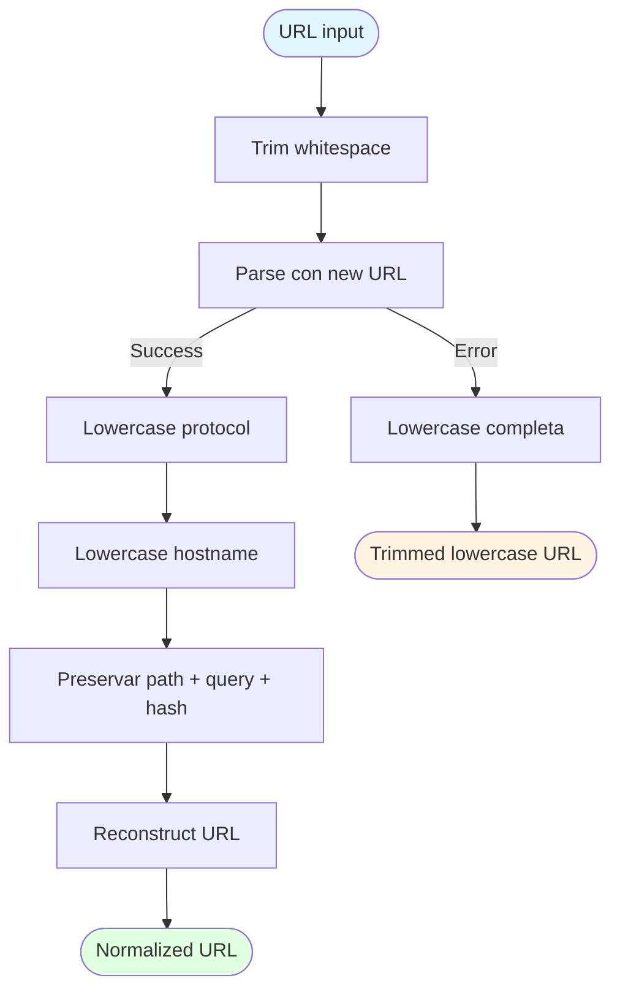
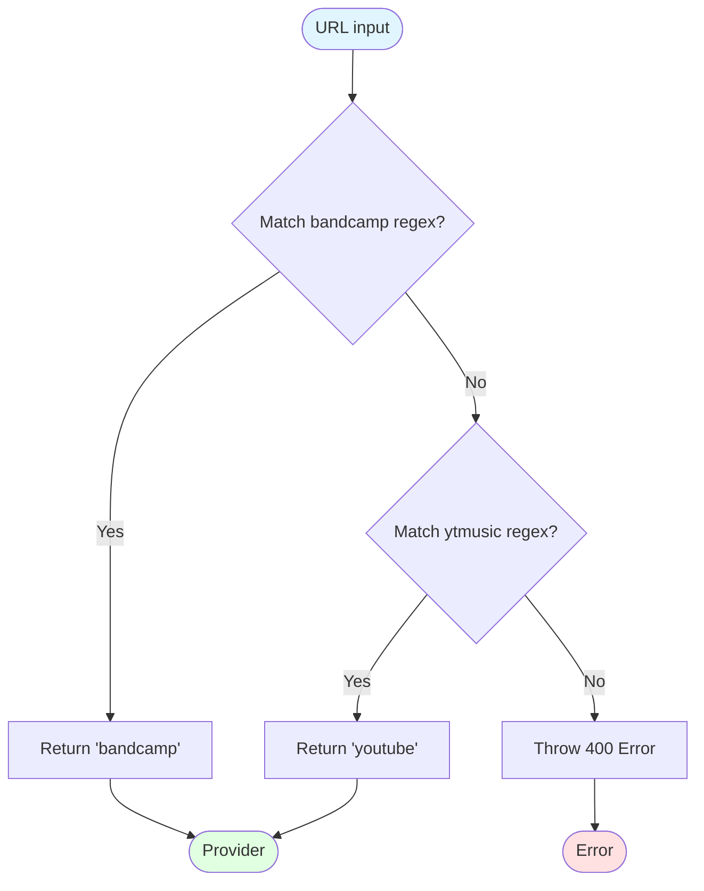
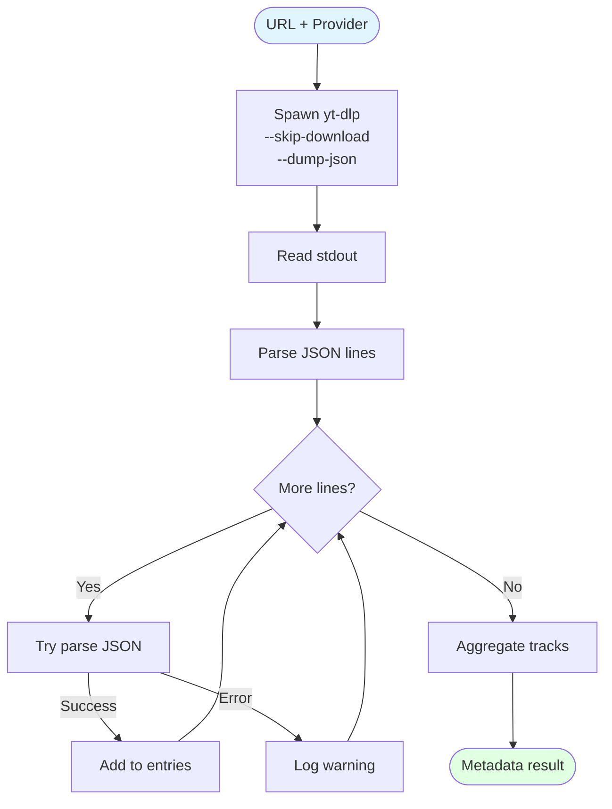
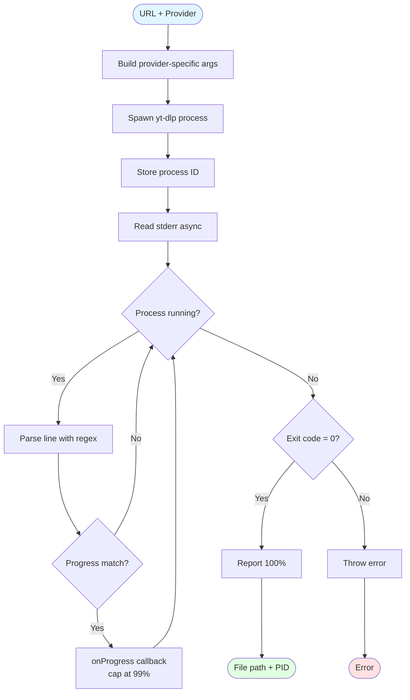
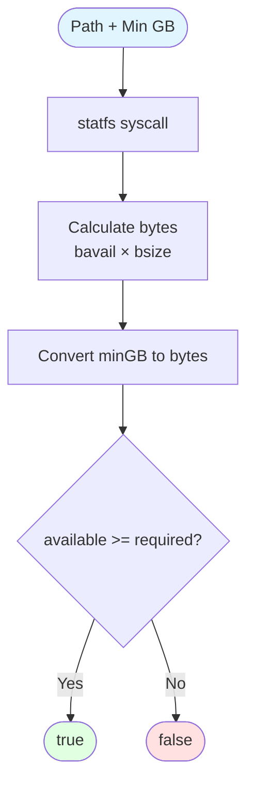

# Servicios de Aplicación

Este documento describe los servicios que proveen funcionalidad específica a los casos de uso.

## 1. UrlNormalizer

Normaliza URLs para detección consistente de duplicados.



### Snippet: Normalización

```typescript
normalize(url: string): string {
  const trimmed = url.trim();
  const parsed = new URL(trimmed);
  
  // Protocol y hostname a lowercase
  const protocol = parsed.protocol.toLowerCase();  // HTTPS → https
  const hostname = parsed.hostname.toLowerCase();  // BandCamp.com → bandcamp.com
  
  // Preservar path y query (yt-dlp los necesita)
  return `${protocol}//${hostname}${parsed.pathname}${parsed.search}${parsed.hash}`;
}
```

**Ejemplos**:
- `"  HTTPS://BandCamp.com/track/song  "` → `"https://bandcamp.com/track/song"`
- `"https://Music.YouTube.com/watch?v=ABC"` → `"https://music.youtube.com/watch?v=ABC"`

Path y query params se preservan exactamente porque yt-dlp los usa para identificar contenido.

## 2. PlatformDetector

Valida URLs y detecta provider soportado.



### Snippet: Regex Validación

```typescript
// Regex case-insensitive
private bandcampRegex = /bandcamp\.com\/(track|album)\//i;
private ytmusicRegex = /music\.youtube\.com\/(watch|playlist)/i;

validateOrThrow(url: string): Provider {
  if (this.bandcampRegex.test(url)) {
    return "bandcamp";
  }
  
  if (this.ytmusicRegex.test(url)) {
    return "youtube";
  }
  
  throw new Error(
    "Invalid URL. Only Bandcamp (track/album) and YouTube Music (watch/playlist) URLs are supported."
  );
}
```

**URLs soportadas**:
- ✅ `https://artist.bandcamp.com/track/song`
- ✅ `https://artist.bandcamp.com/album/album-name`
- ✅ `https://music.youtube.com/watch?v=abc123`
- ✅ `https://music.youtube.com/playlist?list=xyz789`
- ❌ `https://youtube.com/watch?v=abc123` (no es music.youtube.com)
- ❌ `https://spotify.com/track/123` (no soportado)

## 3. MetadataExtractor

Extrae metadata con yt-dlp sin descargar contenido.



### Snippet: Spawn y Parse

```typescript
async extract(url: string, provider: Provider): Promise<MetadataResult> {
  // Spawn yt-dlp sin descargar
  const process = spawn({
    cmd: ["yt-dlp", "--skip-download", "--dump-json", "--flat-playlist", url],
    stdout: "pipe"
  });

  // Leer stdout línea por línea
  const output = await new Response(process.stdout).text();
  const lines = output.trim().split("\n");
  
  const entries: any[] = [];
  for (const line of lines) {
    try {
      const data = JSON.parse(line);
      entries.push(data);
    } catch (error) {
      this.logger.warn({ line }, "Failed to parse JSON line");
    }
  }

  // Primera línea es metadata principal
  const mainData = entries[0] || {};
  
  // Si hay múltiples líneas, es álbum/playlist
  if (entries.length > 1) {
    mainData.entries = entries.slice(1);
    mainData._type = "playlist";
  }

  return mainData;
}
```

**Output para track**:
```json
{
  "id": "abc123",
  "title": "Song Name",
  "artist": "Artist Name",
  "duration": 240
}
```

**Output para álbum** (múltiples líneas):
```json
{"id": "xyz789", "title": "Album Name", "_type": "playlist"}
{"id": "track1", "title": "Track 1", "playlist_index": 1, "duration": 180}
{"id": "track2", "title": "Track 2", "playlist_index": 2, "duration": 200}
```

## 4. DownloadExecutor

Ejecuta descarga yt-dlp con tracking de progreso.



### Snippet: Progress Parsing

```typescript
// Regex para extraer porcentaje de stderr
const progressRegex = /\[download\]\s+(\d+\.?\d*)%/;

// Leer stderr asíncronamente
const reader = process.stderr.getReader();
const decoder = new TextDecoder();

const readStderr = async () => {
  while (true) {
    const { done, value } = await reader.read();
    if (done) break;
    
    const text = decoder.decode(value, { stream: true });
    const lines = text.split("\n");
    
    for (const line of lines) {
      const match = progressRegex.exec(line);
      if (match) {
        // Cap a 99% durante descarga
        const progress = Math.min(99, Math.floor(parseFloat(match[1])));
        await onProgress(progress);
      }
    }
  }
};

// Esperar exit del proceso
const exitCode = await process.exited;
if (exitCode === 0) {
  await onProgress(100);  // Solo reportar 100% en éxito
}
```

### Snippet: Args Provider-Specific

```typescript
// Args comunes (ambos providers)
const common = [
  "yt-dlp",
  "--cookies-from-browser", "firefox",
  "-x", "--audio-format", "mp3",
  "--audio-quality", "0",
  "--embed-thumbnail",
  "--add-metadata",
  "-P", outputPath
];

// Bandcamp: usa uploader/album para paths
if (provider === "bandcamp") {
  return [
    ...common,
    "-o", "%(uploader)s/%(album,title)s/%(playlist_index)02d %(title)s.%(ext)s"
  ];
}

// YouTube Music: normalización extensa metadata
return [
  ...common,
  "--replace-in-metadata", "artist", " - Topic$", "",        // Remove "- Topic"
  "--replace-in-metadata", "album_artist", "Various Artists", "Varios Artistas",
  "--parse-metadata", "%(playlist_index|track_number)s:%(track_number)s",
  "-o", "%(album_artist|Varios Artistas)s/%(album)s/%(playlist_index)02d %(title)s.%(ext)s"
];
```

## 5. StorageService

Verifica espacio disponible en disco.



### Snippet: Cálculo Storage

```typescript
async hasEnoughSpace(path: string, minGB: number): Promise<boolean> {
  // Query filesystem stats
  const stats = await statfsAsync(path);
  
  // Calculate available bytes
  const availableBytes = stats.bavail * stats.bsize;
  
  // Convert GB to bytes (1 GB = 1024³ bytes)
  const minBytes = minGB * 1024 * 1024 * 1024;
  
  return availableBytes >= minBytes;
}

// Ejemplo de uso en ProcessDownload
const hasSpace = await this.storageService.hasEnoughSpace(tempDir, 1);  // 1 GB mínimo
if (!hasSpace) {
  await this.downloadRepo.updateStatus(id, "failed", 0, "Insufficient storage");
  this.eventEmitter.emitWithId("storage:low", {
    availableGB: availableBytes / (1024 ** 3),
    requiredGB: 1
  });
  throw new Error("Insufficient storage space");
}
```

**Estructura statfs**:
```typescript
interface StatFsResult {
  bavail: number;  // Available blocks for unprivileged users
  bsize: number;   // Block size in bytes
  // ... otros campos
}

// Ejemplo: 10 GB disponibles
// bavail = 2621440 blocks
// bsize = 4096 bytes/block
// available = 2621440 × 4096 = 10737418240 bytes = 10 GB
```

## Recomendaciones

⚠️ **Validar URL con PlatformDetector antes de spawn**: Siempre validar URL antes de ejecutar comandos externos para prevenir command injection. El regex asegura que solo URLs válidas de Bandcamp/YouTube Music se procesan.

💡 **Timeout 60min subprocess**: Descargas grandes (álbumes completos de Bandcamp) pueden tomar tiempo. El scheduler `MarkStalledDownloads` detecta procesos estancados >60min y los marca como fallidos. Configurable con env var `DOWNLOAD_TIMEOUT_MINUTES`.

✅ **Normalizar metadata artist removiendo sufijos**: YouTube Music añade sufijos como "- Topic" a artistas autogenerados. Los args yt-dlp usan `--replace-in-metadata` para limpiar: `"Artist - Topic"` → `"Artist"`. También maneja "Various Artists" → "Varios Artistas" para consistencia.

🔧 **Args yt-dlp específicos por provider**: Bandcamp usa `uploader/album` para estructurar carpetas, YouTube Music usa `album_artist/album`. Esta diferencia refleja metadata disponible: Bandcamp no siempre proporciona `album_artist` separado del `uploader`.

⚠️ **Cap progress a 99% hasta exit exitoso**: Durante descarga, progress se reporta con máximo 99%. Solo al confirmar `exitCode === 0` se reporta 100%. Esto previene UI mostrando "completado" cuando el proceso falló en post-processing (embed thumbnail, add metadata).

---

**Ver también**:
- [Workflows](workflows.md#process-download) - Uso de servicios en workflows
- [DownloadExecutor.ts](../src/core/application/download/services/DownloadExecutor.ts) - Implementación completa con JSDoc
- [Domain Model](domain-model.md) - Entidades que usan estos servicios
