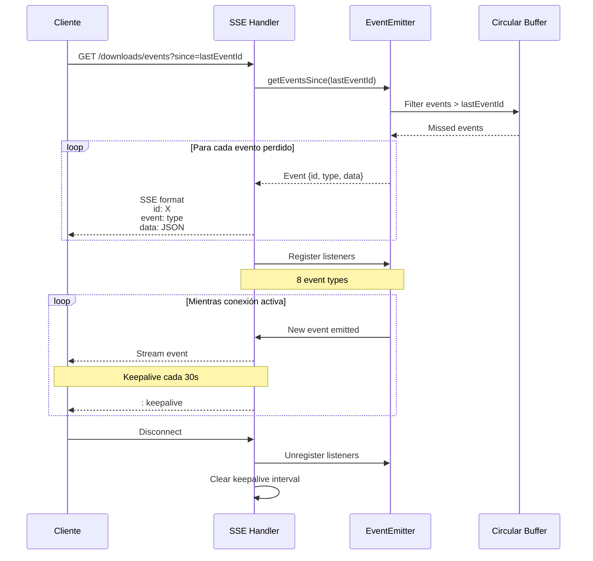
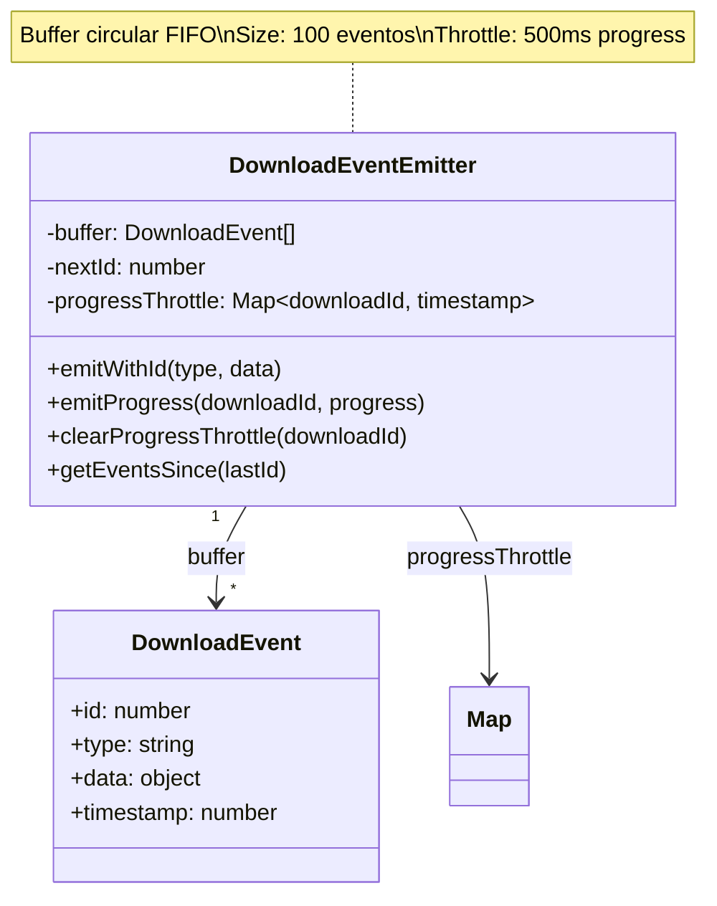
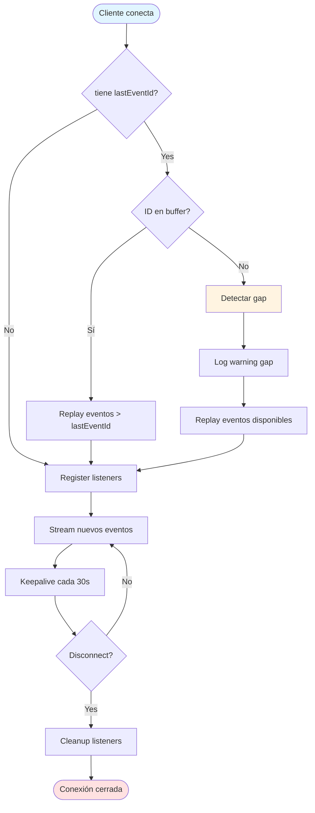

# Sistema SSE (Server-Sent Events)

Este documento describe el sistema de eventos en tiempo real usando Server-Sent Events con recuperación automática.

## Arquitectura SSE con Recuperación



## Componentes del EventEmitter



## Tabla de Eventos

| Evento | Trigger | Payload | Throttled |
|--------|---------|---------|-----------|
| `download:enqueued` | Usuario encola descarga | `{downloadId, url, status}` | No |
| `download:started` | Worker inicia proceso | `{downloadId, url}` | No |
| `download:progress` | Actualización progreso yt-dlp | `{downloadId, progress, url}` | ✅ Sí (500ms) |
| `download:completed` | Descarga exitosa | `{downloadId, filePath, url}` | No |
| `download:failed` | Error en descarga | `{downloadId, error, url}` | No |
| `download:cancelled` | Usuario cancela | `{downloadId, url, status}` | No |
| `download:stalled` | Timeout detectado | `{downloadId, url, status, error}` | No |
| `storage:low` | Espacio insuficiente | `{availableGB, requiredGB}` | No |

## Flowchart de Recuperación



### Gap Detection

**Gap ocurre cuando**: `lastEventId` del cliente está fuera del buffer (eventos muy antiguos ya fueron descartados).

**Estrategias de manejo**:
1. **Client-side**: Detectar gap comparando IDs recibidos, reconectar sin `lastEventId` para stream completo
2. **Server-side**: Log warning pero enviar eventos disponibles
3. **UI**: Refrescar estado completo con polling API REST

## Snippets

### Formato SSE

```typescript
// Formato estándar SSE (3 campos)
await stream.writeSSE({
  id: event.id.toString(),        // Event ID monotónico
  event: event.type,               // Tipo de evento (download:started, etc.)
  data: JSON.stringify(event.data) // Payload JSON
});

// Output en stream:
// id: 42
// event: download:progress
// data: {"downloadId":123,"progress":50}
//
```

### Throttle Check

```typescript
emitProgress(downloadId: number, progress: number): void {
  const now = Date.now();
  const lastEmit = this.progressThrottle.get(downloadId);

  // Skip si último emit fue hace menos de 500ms
  if (lastEmit && now - lastEmit < this.throttleMs) {
    return;  // Evento descartado silenciosamente
  }

  // Actualizar timestamp y emitir
  this.progressThrottle.set(downloadId, now);
  this.emitWithId("download:progress", { downloadId, progress });
}
```

### Buffer Push/Shift

```typescript
emitWithId(type: DownloadEventType, data: DownloadEventData): void {
  const event: DownloadEvent = {
    id: this.nextId++,  // Monotonic increment (nunca resetea)
    type,
    data,
    timestamp: Date.now()
  };

  // Push a buffer
  this.buffer.push(event);
  
  // Mantener tamaño máximo (drop oldest)
  if (this.buffer.length > this.bufferSize) {
    this.buffer.shift();  // Remove first (oldest)
  }

  this.emit(type, event);  // Emit to Node EventEmitter listeners
}
```

### Cliente JavaScript (Ejemplo)

```javascript
// Cliente con soporte de recuperación
let lastEventId = localStorage.getItem('lastEventId') || '0';

const eventSource = new EventSource(
  `/downloads/events?since=${lastEventId}`
);

eventSource.addEventListener('download:progress', (event) => {
  const data = JSON.parse(event.data);
  console.log(`Download ${data.downloadId}: ${data.progress}%`);
  
  // Guardar lastEventId para recuperación
  localStorage.setItem('lastEventId', event.lastEventId);
});

// Reconexión automática con exponential backoff
eventSource.onerror = (error) => {
  console.error('SSE error:', error);
  eventSource.close();
  
  // Reconectar con backoff (1s, 2s, 4s, 8s max)
  const delay = Math.min(1000 * Math.pow(2, retryCount), 8000);
  setTimeout(() => {
    connectSSE();  // Reintentar conexión
  }, delay);
};
```

## Recomendaciones

💡 **Buffer circular 100 eventos soporta ~1min ventana de recuperación**: Con tasa típica de ~2 eventos/segundo (progress updates throttled), 100 eventos cubren aproximadamente 50 segundos de actividad. Clientes desconectados <50s pueden recuperar completamente sin gaps.

✅ **Throttling 500ms para `download:progress` balancea responsiveness vs overhead**: Sin throttle, yt-dlp reporta progress cada 100ms generando 10 eventos/seg. Con throttle 500ms, se reduce a 2 eventos/seg manteniendo UI responsiva sin sobrecargar red/CPU.

⚠️ **Implementar exponential backoff en cliente para reconexiones**: Browser reconecta automáticamente SSE pero sin backoff puede causar storm de conexiones si server tiene problemas. Backoff típico: 1s, 2s, 4s, 8s (max).

🔧 **Cliente debe enviar `Last-Event-ID` header en reconnect para recuperación seamless**: Aunque query param `?since=` funciona, el header `Last-Event-ID` es estándar SSE y permite recuperación automática sin client-side logic adicional. Hono SSE handler soporta ambos.

💡 **Detectar gaps comparando IDs consecutivos**: Cliente puede detectar gap si recibe event ID 105 después de 102 (falta 103, 104). En este caso, reconectar sin `lastEventId` para refrescar estado completo o usar polling REST API para sincronización.

---

**Ver también**:
- [Workflows](workflows.md#eventos-emitidos) - Qué operaciones emiten qué eventos
- [Infrastructure](infrastructure.md#sistema-de-eventos-eventemitter) - Detalles técnicos EventEmitter
- [sse.ts](../src/router/download/sse.ts) - Implementación handler SSE
- [DownloadEventEmitter.ts](../src/core/infrastructure/events/DownloadEventEmitter.ts) - Implementación completa
