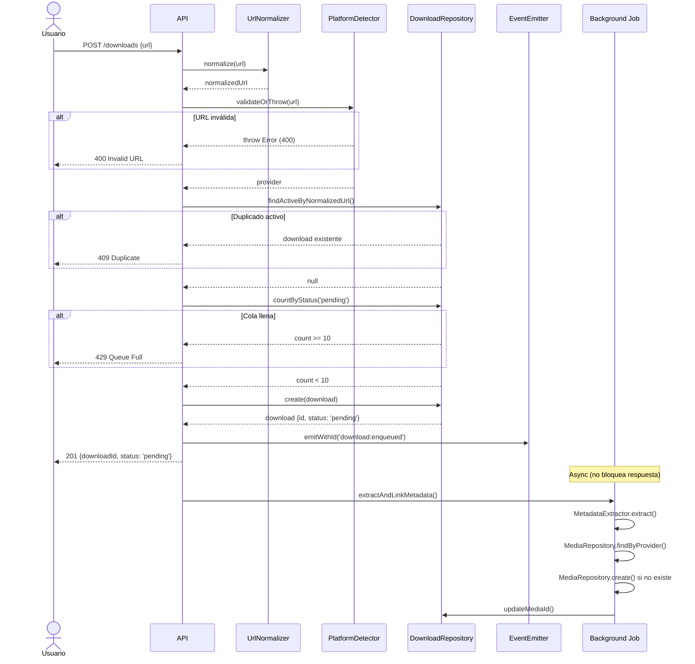
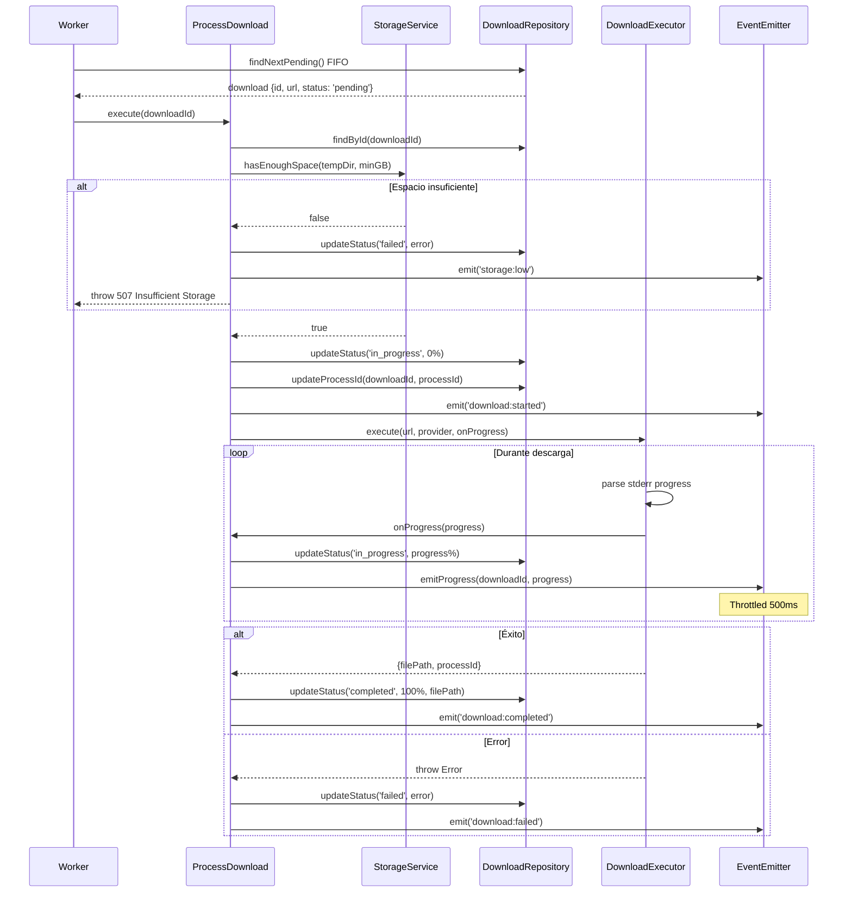
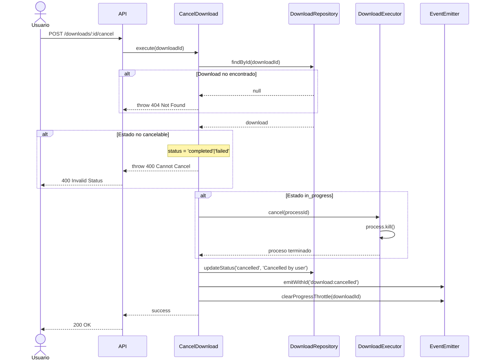
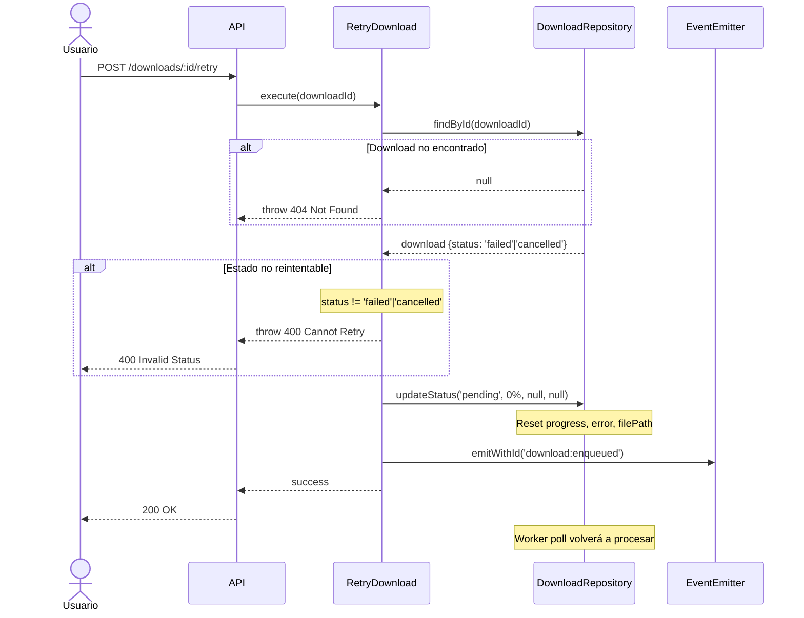
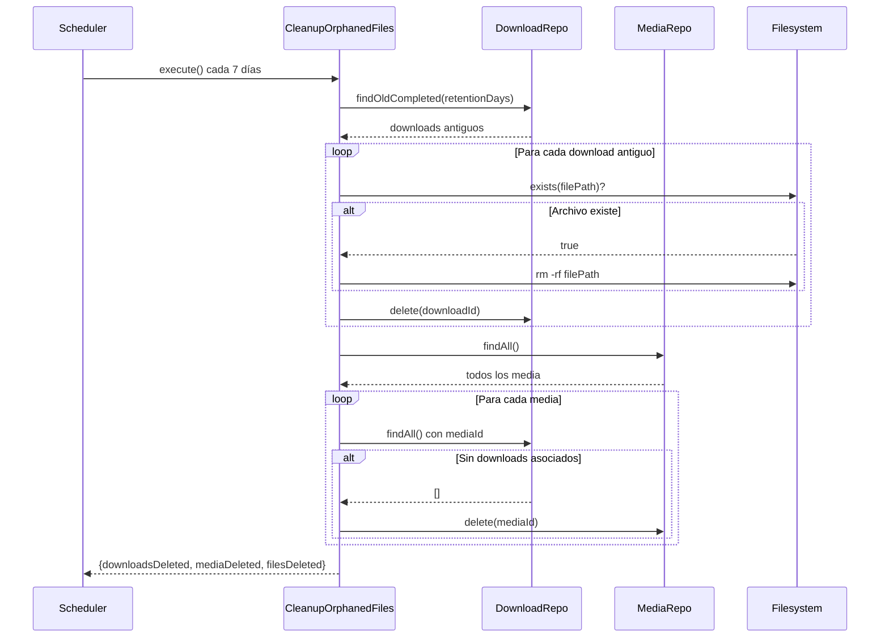
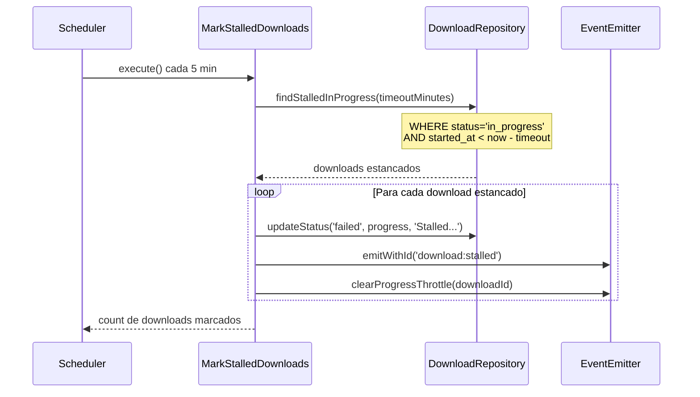

# Workflows Principales

Este documento describe los flujos de operaciones principales del sistema con diagramas de secuencia y snippets de código TypeScript.

## 1. Enqueue Download (Encolar Descarga)

Flujo completo desde la solicitud del usuario hasta el encolado con metadata extraction en background.



### Snippet: Detección de Duplicados

```typescript
// Normalizar URL para comparación consistente
const normalizedUrl = this.urlNormalizer.normalize(url);
// "https://BANDCAMP.com/Track/Song" → "https://bandcamp.com/Track/Song"

// Buscar downloads activos con misma URL normalizada
const existingDownload = await this.downloadRepo.findActiveByNormalizedUrl(normalizedUrl);
if (existingDownload) {
  throw new Error('A download for this URL is already pending or in progress');
}
```

### Snippet: Validación Límite Cola

```typescript
// Verificar límite máximo de descargas pendientes
const pendingCount = await this.downloadRepo.countByStatus('pending');
if (pendingCount >= this.maxPending) {
  // default: 10
  throw new Error(`Maximum ${this.maxPending} pending downloads reached`);
}
```

## 2. Process Download (Procesar Descarga)

Worker procesa descargas de la cola FIFO ejecutando yt-dlp con tracking de progreso.



### Snippet: Parsing Progreso yt-dlp

```typescript
// Regex para extraer porcentaje de stderr yt-dlp
const progressRegex = /\[download\]\s+(\d+\.?\d*)%/;

const lines = stderrText.split('\n');
for (const line of lines) {
  const match = progressRegex.exec(line);
  if (match) {
    const progress = Math.min(99, Math.floor(parseFloat(match[1])));
    await onProgress(progress); // Cap a 99% durante descarga
  }
}
// Reportar 100% solo en exit exitoso
```

### Snippet: Query Timeout Stalled

```typescript
// Query SQL para downloads estancados
const query = `
  SELECT * FROM downloads 
  WHERE status = 'in_progress' 
    AND started_at < datetime('now', '-? minutes')
`;
// Parámetro: timeoutMinutes (default 60)
```

## 3. Cancel Download (Cancelar Descarga)

Usuario cancela descarga activa, matando proceso yt-dlp si está ejecutándose.



### Snippet: Cancelación de Proceso

```typescript
// Verificar estado cancelable
if (download.status !== 'pending' && download.status !== 'in_progress') {
  throw new Error(`Cannot cancel download with status: ${download.status}`);
}

// Matar proceso yt-dlp si está en ejecución
if (download.processId && download.status === 'in_progress') {
  this.downloadExecutor.cancel(download.processId);
  // Envía SIGKILL al proceso
}

// Limpiar estado throttle de eventos de progreso
this.eventEmitter.clearProgressThrottle(downloadId);
```

## 4. Retry Download (Reintentar Descarga)

Usuario reintenta descarga fallida o cancelada, resetando a estado pending.



### Snippet: Reset a Pending

```typescript
// Validar estado reintentable
if (download.status !== 'failed' && download.status !== 'cancelled') {
  throw new Error(`Cannot retry download with status: ${download.status}`);
}

// Reset completo a estado inicial
await this.downloadRepo.updateStatus(
  downloadId,
  'pending', // nuevo status
  0, // progress reset
  null, // clear error_message
  null // clear file_path
);

// Re-emitir evento de encolado
this.eventEmitter.emitWithId('download:enqueued', {
  downloadId,
  url: download.url,
  status: 'pending'
});
```

## 5. Cleanup Orphaned Files (Limpieza Archivos Huérfanos)

Scheduler semanal elimina downloads antiguos y media sin referencias.



### Snippet: Limpieza con Manejo de Errores

```typescript
// Buscar downloads completados/fallidos antiguos
const oldDownloads = await this.downloadRepo.findOldCompleted(this.retentionDays);

for (const download of oldDownloads) {
  try {
    // Eliminar archivo si existe
    if (download.filePath && (await exists(download.filePath))) {
      await rm(download.filePath, { recursive: true, force: true });
      filesDeleted++;
    }

    // Eliminar registro DB
    await this.downloadRepo.delete(download.id);
    downloadsDeleted++;
  } catch (error) {
    // Log error pero continuar limpieza
    this.logger.warn({ error, downloadId: download.id }, 'Failed to cleanup');
  }
}
```

## 6. Mark Stalled Downloads (Marcar Descargas Estancadas)

Scheduler cada 5min detecta descargas estancadas y las marca como fallidas.



### Snippet: Query Temporal Stalled

```typescript
// Método repositorio para encontrar estancados
async findStalledInProgress(timeoutMinutes: number): Promise<DownloadItem[]> {
  const query = `
    SELECT * FROM downloads
    WHERE status = 'in_progress'
      AND started_at < datetime('now', '-' || ? || ' minutes')
  `;
  const rows = this.db.query(query).all(timeoutMinutes);
  return rows.map(DownloadItem.fromDatabase);
}

// Uso en use case
const stalledDownloads = await this.downloadRepo.findStalledInProgress(60);
// Encuentra downloads en progreso iniciados hace más de 60 minutos
```

## Eventos Emitidos por Workflow

| Workflow             | Eventos Emitidos                                                                                            | Payload                                                                                                                            |
| -------------------- | ----------------------------------------------------------------------------------------------------------- | ---------------------------------------------------------------------------------------------------------------------------------- |
| EnqueueDownload      | `download:enqueued`                                                                                         | `{downloadId, url, status}`                                                                                                        |
| ProcessDownload      | `download:started`<br/>`download:progress`<br/>`download:completed`<br/>`download:failed`<br/>`storage:low` | `{downloadId}`<br/>`{downloadId, progress}`<br/>`{downloadId, filePath}`<br/>`{downloadId, error}`<br/>`{availableGB, requiredGB}` |
| CancelDownload       | `download:cancelled`                                                                                        | `{downloadId, url, status}`                                                                                                        |
| RetryDownload        | `download:enqueued`                                                                                         | `{downloadId, url, status}`                                                                                                        |
| MarkStalledDownloads | `download:stalled`                                                                                          | `{downloadId, url, status, error}`                                                                                                 |

Ver [download-logs-api.md](download-logs-api.md) para detalles del sistema de logs.

## Recomendaciones

⚠️ **No reintentar descargas automáticamente**: Las descargas fallidas requieren acción explícita del usuario vía `RetryDownload`. Esto previene loops infinitos con URLs problemáticas y permite al usuario investigar el error antes de reintentar. Ver [CancelDownload.ts](../src/core/application/download/use-cases/CancelDownload.ts) para manejo de errores.

💡 **Limitar progress al 99% hasta exit del proceso**: Durante la ejecución de yt-dlp, el progreso se reporta con cap de 99%. Solo al exit exitoso (code 0) se reporta 100%. Esto evita falsos positivos donde el progreso llegó a 100% pero el proceso falló en post-processing. Ver [DownloadExecutor.ts](../src/core/application/download/services/DownloadExecutor.ts#L150-165).

✅ **Ejecutar cleanup scheduler en horarios baja carga**: El scheduler de limpieza (`CleanupOrphanedFiles`) se recomienda ejecutar entre 2-4am para minimizar impacto en operaciones de usuario. Operaciones de filesystem (rm -rf) pueden ser costosas con muchos archivos.

🔧 **Timeout 60min configurable via env var**: El timeout de detección de descargas estancadas es configurable con `DOWNLOAD_TIMEOUT_MINUTES` (default 60). Ajustar según tamaño típico de álbumes en tu caso de uso. Álbumes grandes de Bandcamp pueden necesitar más tiempo.

---

**Ver también**:

- [Services](services.md#downloadexecutor) - Detalles de ejecución yt-dlp
- [Domain Model](domain-model.md) - Máquina de estados Download
- [Download Logs API](download-logs-api.md) - Sistema de logs persistentes con REST API
